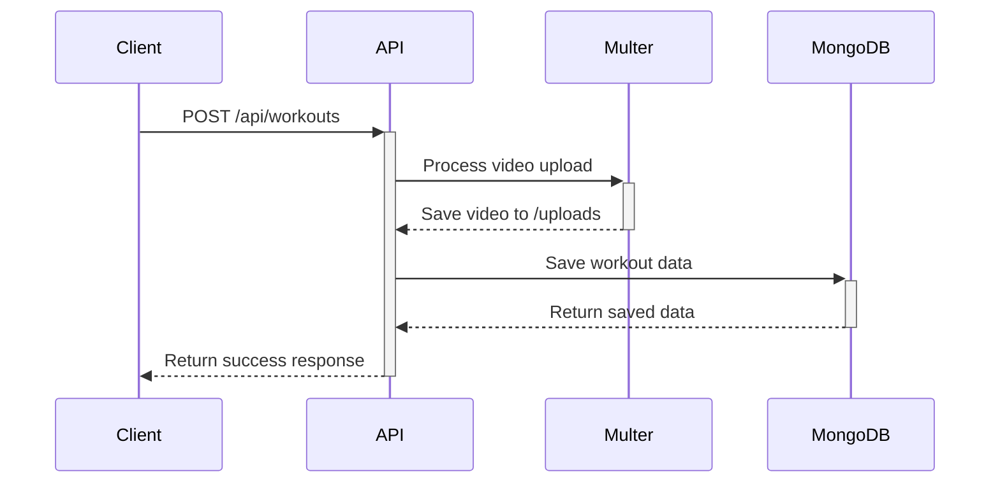
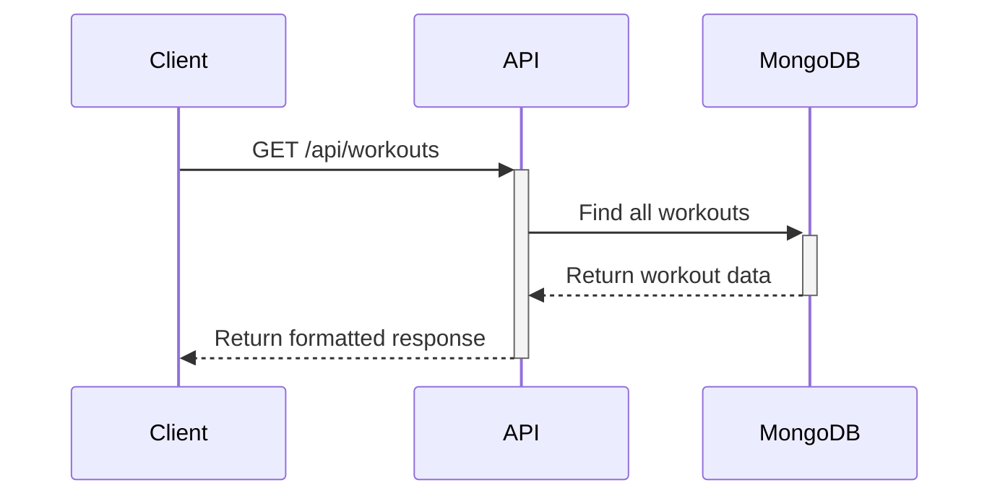

# Workout API Documentation

## Overview
API ini digunakan untuk mengelola program latihan (workout) dengan kemampuan untuk menyimpan data latihan dan video tutorial.

## Architecture
```
workout-api/
├── public/
│   └── uploads/        # Folder untuk menyimpan video
├── src/
│   ├── config/         # Konfigurasi database
│   ├── controllers/    # Logic bisnis
│   ├── middleware/     # Middleware (upload, auth, etc)
│   ├── models/         # Model database
│   ├── routes/         # Definisi routes
│   └── app.js         # Entry point aplikasi
└── .env               # Environment variables
```

## Database Schema
### Workout Collection
```javascript
{
  name: String,        // Nama program latihan
  description: String, // Deskripsi program
  videoUrl: String,    // URL video tutorial
  createdAt: Date,     // Waktu pembuatan
  updatedAt: Date      // Waktu update terakhir
}
```

## API Endpoints

### 1. Create New Workout
- **URL**: `/api/workouts`
- **Method**: `POST`
- **Content-Type**: `multipart/form-data`

**Request Body:**
| Field       | Type   | Description        |
|-------------|--------|--------------------|
| name        | string | Nama latihan       |
| description | string | Deskripsi latihan  |
| video       | file   | File video tutorial|

**Success Response (201):**
```json
{
    "id": "675a946400dfa7cd761a7521",
    "name": "Joging",
    "description": "olahraga sehat",
    "video_url": "/uploads/1733989476286.mp4"
}
```

### 2. Get All Workouts
- **URL**: `/api/workouts`
- **Method**: `GET`

**Success Response (200):**
```json
[
    {
        "id": "675a946400dfa7cd761a7521",
        "name": "Joging",
        "description": "olahraga sehat",
        "video_url": "/uploads/1733989476286.mp4"
    }
]
```

## Sequence Diagrams

### Create Workout Flow


### Get Workouts Flow


## Setup Instructions

### 1. Install Dependencies
```bash
npm install
```

### 2. Environment Setup
Create `.env` file:
```env
PORT=3000
MONGODB_URI=mongodb://localhost:27017/workout-db
```

### 3. Create Upload Directory
```bash
mkdir -p public/uploads
```

### 4. Run Server
```bash
npm run dev
```

## Testing

### Using Postman

#### Create Workout:
- Method: `POST`
- URL: `http://localhost:3000/api/workouts`
- Body: `form-data`
  ```
  name: "Joging"
  description: "olahraga sehat"
  video: [select file]
  ```

#### Get Workouts:
- Method: `GET`
- URL: `http://localhost:3000/api/workouts`

### Using cURL

#### Create Workout:
```bash
curl -X POST \
  -F "name=Joging" \
  -F "description=olahraga sehat" \
  -F "video=@/path/to/video.mp4" \
  http://localhost:3000/api/workouts
```

#### Get Workouts:
```bash
curl http://localhost:3000/api/workouts
```

## Dependencies
- `express`: Web framework
- `mongoose`: MongoDB ODM
- `multer`: File upload handling
- `dotenv`: Environment configuration

## Error Handling
| Status Code | Description    |
|-------------|----------------|
| 200         | Success        |
| 201         | Created        |
| 400         | Bad Request    |
| 404         | Not Found      |
| 500         | Server Error   |

## Video Access
Videos dapat diakses melalui browser dengan format URL:
```
http://localhost:3000/uploads/{filename}
```

Contoh:
```
http://localhost:3000/uploads/1733989476286.mp4
```